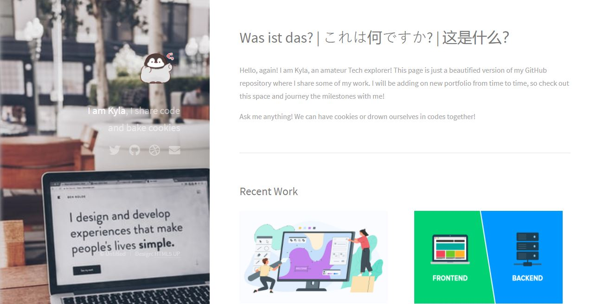

<h1 align="center">How to create a GitHub Portfolio Page?</h1>

## Introduction <br>
Are you looking to build your own webpage? Found nothing that you like on GitHub Pages? Well, you can create a more aesthetic web page through this repository!
I created this repository to share my projects and to journey the milestones I've made in NUS FinTech programme. Let's create a beautiful webpage together through this step-by step-guide!<br>

## Step 1: Download a portfolio template that you like!

1. Search for a template @ [Themezy](http://themezy.com), [Jekyll](http://jekyllrb.com), [HTML5 Up](http://HTML5up.net), [Bootstrapmade](http://bootstrapmade.com) and other websites. <br>
2. Download template (in zipped file), save the uncompressed zip file to your local drive. <br>
3. Create a directory to store your file. I created mine in Desktop/GitHub/Repository/Portfolio <br>

## Step 2: Create a repository!
1. Head over to GitHub and create a new public repository named <b>`username.github.io`</b>, where username is your username (or organization name) on GitHub. <br>

## Step 3: Clone the repository!
1. Launch your terminal/command prompt using Virtual Studio Code (eg. Open Virtual Studio Code > Terminal > New Terminal)<br>

2. Type the following to initialise your Git:<br>
<b>`git init`</b><br>

3. Copy your GitHub repository URL to this code and run it!<br>
<b>`git remote add origin https://github.com/username/username.github.io`</b><br>
  
4. Run the following code:<br>
<b>`git fetch`</b><br>

5. Go to the folder where you want to store your project, and clone the new repository by running this command: <br>
<b>`git clone https://github.com/username/username.github.io`</b><br>
###### <i>Note: Remember to replace the 'username' with your own username</i> <br>

## Step 4: Import the downloaded template!
1. Import the downloaded template (Step 1) into the cloned repository by doing this: <br>
2. Open Virtual Studio Code > File > Open Folder > Select the downloaded template <br>
(eg. My file is stored in Desktop/GitHub/Repository/Portfolio) <br>

###### <i>Note: Make sure the index.html file is at the root of this directory.</i><br>

## Step 5: Push it!
1. Have fun playing with your codes in Virtual Studio Code! Remember to add, commit and push the changes you made onto GitHub<br>
2. How? Run the following code (one after another) in Virtual Studio Code:<br>
<b>`git add -A`</b><br>
<b>`git commit -m “add any comments or remark here”`</b><br>
<b>`git push origin master`</b><br>

## Step 6: It's up on your page!
1. Navigate to http://username.github.io to see your newly created online portfolio.
2. Check out my page @ https://kylalimza.github.io!
<br><br><br>



<h1 align="center">Bonus: How to get Whatsapp Alert Notification?</h1>

## Introduction
Wants to get updated? You can notified on Whatsapp whenever changes to push an update are made in your GitHub repositories.

## Tips
Make use of Marketplace which has amazing resources! I searched for ```Whatsapp``` and I forked from [here](https://github.com/ishween/whatsapp-push-notify-action).<br>

## Step 1: Create a Twilio Account
1. Create an account in Twilio from [here](https://www.twilio.com/)
2. Open your Twilio Dashboard and copy the code in ```Account Sid``` and ```Auth Token```.

## Step 2:  Configure your repository secrets
1. Go to GitHub and navigate to your repository secrets ```Settings > Secrets```
2. Add below secrets using button ```New repository secret```
* Name your respository secret as ```ACCOUNT_SID``` and enter the code copied from Twilio into the 'Value'
* Once it's created, do the same for ```AUTH_TOKEN``` and another for ```TO_WHATSAPP_NO```.

You should have created 3 repository secrets like this: 

 Name              | Value                                              | 
-------------------|----------------------------------------------------|
ACCOUNT_SID        | ```ACCOUNT SID``` copied earlier
AUTH_TOKEN         | ```AUTH TOKEN``` copied earlier
TO_WHATSAPP_NO     | Your Whatsapp Number 


## Step 3: Subscribe to Twilio Whatsapp Sandbox
1. Go to [Sandbox URL](https://www.twilio.com/console/sms/whatsapp/sandbox)<br>
1. Go to your phone and add a Twilio number: ```+14155238886```
2. Open your Whatsapp on your phone, send a message to the above Twilio number in the below format:
   > join "xxxxxx" 
###### <i>Note: The "xxxxxx" is different for everyone. Remember to follow the instructions on your Twilio account!</i><br>


## Step 4: Prepare the Action Workflow
1. In your repository page, navigate to ```Actions > New Workflow > set up a workflow yourself```. It will open up a ```yaml``` file in code editor.
2. Replace everything in this ```yaml``` file with below:

```yaml
name: Whatsapp Notification

on: [push]

jobs:
  build:
    runs-on: ubuntu-latest
    steps:
      - name: whatsapp-notify
        uses: kylalimza/kylalimza.github.io@main
        env:
          ACCOUNT_SID: ${{ secrets.ACCOUNT_SID }}
          AUTH_TOKEN: ${{ secrets.AUTH_TOKEN }}
          TO_WHATSAPP_NUMBER: ${{ secrets.TO_WHATSAPP_NUMBER }}
```
###### <i>Note: Remember to change the repository directory (bold above) under 'uses' into yours</i><br>

## Step 5: Time for some Actions!
1. Make some changes in your GitHub repository, and commit the changes! 
2. Go to "Actions" and you should be able it running! 

You should be able to receive a notification from Twilio as such whenever an update has been made:<br>


